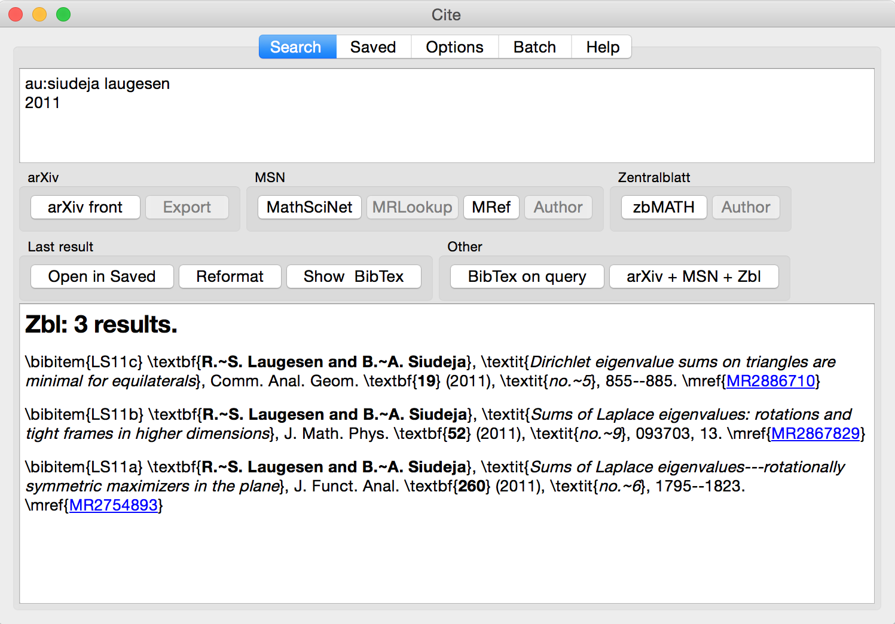

# Citation fetcher with customizable LaTeX/BibTeX output

PyQt GUI and a separate fetching engine for finding mathematics related citations on 
[arXiv](http://front.math.ucdavis.edu), [MathSciNet](http://www.ams.org/mathscinet/) and [zbMATH](https://zbmath.org).



Assuming required packages are present, application can be started with `cite.py`.

### OS X:
* Use Cite.dmg from the latest release. Double click on Services to install them, and put Cite.app in `/Applications` folder.
* With Anaconda: Assuming all requrements are already installed, clone this repository, then run `installMac.sh` to install Services (user confirmation needed) and add `cite` to PATH.
In either case `cite` should work from terminal. 

##### TexShop
The supplied macro cuts the current line (or the selected lines) and runs it through the citation software.

Installation: 
   Go to `Macros->Open Macro Editor`. Click on `New Item` and paste the contents of the `TexShop.applescript` file into the content field. Add some name and a convenient keyboard shortcut. The main Application must be started at least once before running the macro.

### General requirements
* LaTeX/BibTeX
* `PyQt` (4 or 5)
* `bibtexparser` Python package

### Search format
Search supports many field specifiers (author, title, journal, year, ...) as well as logical connectors (and/or/not). The search format is uniform for all databases, with all differences handled behind the scene.

Example search:
```
au:siudeja laugesen
2011
```
will find my papers written with my best collaborator, published in 2011.

It is also possible to feed a fully formatted bibitem or BibTeX entry as a search query, even including all the LaTeX formatting commands.

### Output
Application supports raw BibTeX output, and custom LaTeX outputs: 
* font style can be chosen for authors, title, journal, ...
* bibitem labels can be automatically generated, or preserved if given in the search query
* links to databases can be automatically added

Batch processing is also possible. A list of citations can be processed to find links to databases, create BibTeX file, or to reformat/uniformize the LaTeX output.

### System integration
The main script `cite.py` also accepts querries as parameters, or through stdin. In this case no GUI is created (PyQt is not needed) and the output is sent to stdout. This allows integration with text editors. One could use the following in Vim:
```
nmap ,bb !!cite.py<CR>
vmap ,bb !cite.py<CR>
nmap ,ba !!cite.py -a<CR>
vmap ,ba !cite.py -a<CR>
```
to feed a line, or a selection to the script.

The `,ba` command can be used to force arXiv search. Other options are also available.

### Application settings 
Settings are saved in settings.xml file in the script's folder. This file is processed by both terminal and GUI versions. Hence it is convenient to set the settings in GUI, although the XML file can also be modified.

In PyQt, the settings are handled by a slightly modified [pyqtconfig](https://github.com/mfitzp/pyqtconfig) scipt (supplied).

### OS X
A standalone OS X app should work on OS X 10.10 and 10.11, although constantly changing system environment makes it hard to maintain a working package. The App is in `osx/` subfolder bundled with two Automator scripts in `Cite.app.tar.gz`. The only requirement to run the App is a working LaTaX installation. And it needs to be placed in `/Applications`.
Click on the archive, then on `Raw` button to download it. 

The supplied Automator scripts allow filtering of any selected text through the application.
The output can either replace the selection, or appear in a new TextEdit window. Then right click on a selected text and look for Cite in Services.

## Warning
This is an alpha version.

Some features are not yet fully implemented, and the documentation is lacking.
